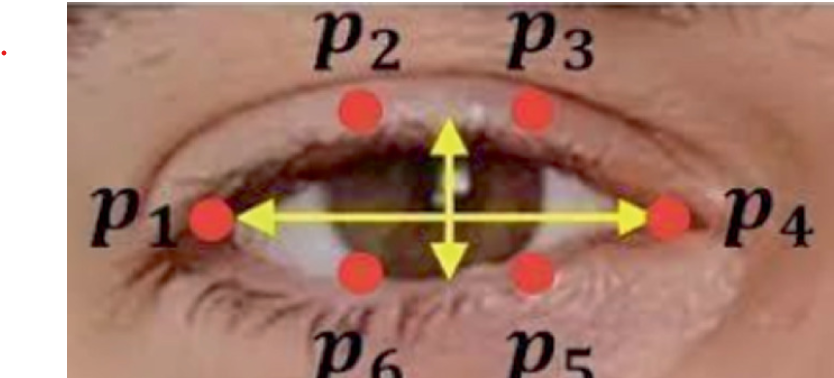

# V-Chat

V-Chat is a Python application that implements gaze typing through a virtual keyboard. It utilizes computer vision to detect eye landmarks and allows users to type by simply looking at the keyboard on their screen.

## Features

- Gaze typing through a virtual keyboard
- Eye landmark detection using the Dlib library
- User-friendly interface developed with Tkinter
- Lightweight and easy to use

## Requirements

- Python 3.x
- OpenCV
- Dlib
- Tkinter
- NumPy

You can install the required libraries using pip:

    pip install opencv-python dlib numpy
## Installation
Clone the repository:

    git clone https://github.com/shreyasoumya/V-Chat.git
    cd V-Chat
Install the required dependencies as mentioned above.

Run the application:

    python v_chat.py

## Usage 
- Ensure your webcam is connected.
- Look at the virtual keyboard displayed on the screen.
- The application will detect your eye landmarks and allow you to type by focusing on the desired keys.

## Screenshots

## Contributing

Contributions are welcome! If you have suggestions for improvements or features, please fork the repository and submit a pull request. Here are some ways you can contribute:
- Report bugs or issues.
- Suggest new features or enhancements.
- Improve documentation.

## License

This project is licensed under the MIT License. See the [LICENSE](LICENSE) file for details.

### Note
1. **Dlib Shape Predictor:** You need the `shape_predictor_68_face_landmarks.dat` file, which is used for face landmark detection. You can download it from [here](http://dlib.net/files/shape_predictor_68_face_landmarks.dat.bz2) and extract it to your project directory.

2. **Gaze Detection Logic:** The `process_landmarks` function is a placeholder where you can implement the gaze detection logic to determine which key is being focused on.

Feel free to customize the README and the code according to your specific requirements! Let me know if you need any adjustments or further help.

